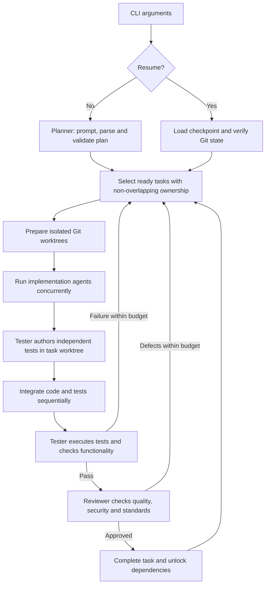

# Architecture and code navigation

## Workflow

The diagram shows the normal path. `workflow/recovery.ts` continues interrupted
stages from their saved state, including a completed implementation that has not
yet been integrated. Integration conflicts retain their own retry path.

## Application boundaries

All paths in this guide are relative to `src/`.

| Area | Responsibility | Start reading |
| --- | --- | --- |
| `cli/` | Parse startup/resume arguments | `arguments.ts` |
| `domain/` | Data contracts and deterministic plan/task rules | `plan.ts`, `scheduler.ts` |
| `agents/planner/` | Build the planning prompt, validate responses, retry malformed plans | `planner.ts` |
| `agents/implementation/` | Run one task's observe/decide/act loop | `run-agent.ts` |
| `agents/code-review/` | Review cumulative task diffs with verified source evidence | `run-code-review.ts` |
| `agents/tester/` | Author independent tests, execute validation and check functionality | `author-tests.ts`, `run-tester.ts` |
| `workflow/` | Coordinate tasks and their persisted stages | `orchestrator.ts` |
| `tools/` | Enforce file/command policy and execute agent tool calls | `agent-tools.ts` |
| `infrastructure/` | Interact with Git, model providers, storage and logging | The relevant subsystem directory |

Domain code does not depend on agent or workflow implementations. Workflow stages
call the agents and infrastructure. Agent tools centralize write permissions and
command policy. Type-only imports connect contracts without creating runtime
initialization dependencies.

`domain/project-state.ts` retains the earlier `Task`/`ProjectState` type definitions
for reference/compatibility. The active workflow uses `ScheduledTask` from
`domain/scheduler.ts` and the checkpoint schema from `domain/workflow-state.ts`.

## Workflow modules

`workflow/orchestrator.ts` is the public class. Its constructor and methods retain
the existing API; the implementation delegates to explicit stage modules.
`workflow/runtime.ts` owns one instance's mutable state and injected dependencies.
Each workflow has a separate runtime; there is no shared task-state singleton.

| Module | Responsibility |
| --- | --- |
| `types.ts` | Constructor options and injectable executor contracts |
| `task-state.ts` | Ready-task selection, lifecycle transitions and task records |
| `execution.ts` | Workflow loop, checkpoint lock lifetime and stop conditions |
| `dispatch.ts` | Concurrent implementation dispatch and sequential integration queue |
| `implementation.ts` | Worktree preparation and saving implementation results |
| `test-authoring.ts` | Scoped test drafts, checkpointed writes and protection of prior assertions |
| `integration.ts` | Integrating a task result and retaining conflict evidence |
| `code-review.ts` | Review gate, structured feedback, execution retries and approval revisions |
| `validation.ts` | Tester attempts, revision-bound PASS, review dispatch and completion |
| `dependencies.ts` | Existing dependency preparation before Tester validation |
| `checkpoints.ts` | Save/restore orchestration state and verify saved revisions |
| `recovery.ts` | Continue interrupted implementation/integration/tester stages |
| `logging.ts` | Structured task outcome logs |

Checkpoint disk I/O, atomic replacement and process locking belong to
`infrastructure/persistence/workflow-store.ts`. Git commands and damaged-worktree
recovery belong to `infrastructure/git/`. Their operational behavior is documented
in [save and resume](resume.md).

## Implementation-agent modules

`execute-task.ts` adapts a scheduled task and prior feedback to `run-agent.ts`.
The agent loop follows the same stages on each step:

1. `prepare-step.ts`: checkpoint, refresh the bounded workspace snapshot and build
   the normal or scope-recovery prompt.
2. `request-action.ts`: call the model, repair supported JSON formatting, validate
   the action protocol and record invalid-response failures.
3. `guard-validation.ts`: require corrective evidence before repeating an
   unchanged failed validation command.
4. `guard-write.ts`: handle repeated writes using verified file changes.
5. `guard-completion.ts`: require changed files and no unresolved command failure.
6. `execute-step.ts`: execute the selected tool and update audit/progress counters.

`run-state.ts` creates the per-attempt state, including restored session evidence
and budgets. Stage helpers return a result, a request to continue to the next
step, or no decision. The outer loop retains the hard step limit and exact stage
order. No helper starts a second agent loop.

Supporting modules keep the protocol (`protocol.ts`), budgets (`budget.ts`),
normal prompt (`prompt.ts`), audit evidence (`audit.ts`), recovery decisions
(`recovery.ts`), and tool dispatch (`execute-action.ts`) separate. Workspace
observations live in `workspace-context.ts`; they never execute validation.

## LLM providers

`infrastructure/llm/models.ts` constructs the existing model clients.
`provider.ts` holds provider selection, logging and fallback-error classification.
`gateway.ts` exposes `askLLM` and retains the active provider for the process.

| `LLM_PROVIDER` | Main configuration |
| --- | --- |
| `openrouter` (default) | `OPENROUTER_API_KEY`, `OPENROUTER_MODEL`, `OPENROUTER_BASE_URL` |
| `openai` | `OPENAI_API_KEY`, `OPENAI_MODEL` |
| `ollama` | `OLLAMA_BASE_URL`, `OLLAMA_MODEL` |
| `groq` | `GROQ_API_KEY`, `GROQ_MODEL` |
| `gemini` | `GOOGLE_API_KEY`, `GEMINI_MODEL` |

An unrecognized provider selects OpenRouter, as before. Quota/credit failures
switch to the configured local Ollama model for subsequent calls. Other provider
errors propagate. Defaults remain in the model configuration; the reorganization
does not change models, temperatures or fallback rules.

## Adding code

- Put plan/task rules in `domain/`, with tests under the relevant `tests/` group.
- Put a new workflow stage beside the other `workflow/` stages; keep the public
  orchestrator small and make its state dependencies explicit.
- Put model instructions beside the agent that uses them.
- Put file and process restrictions in `tools/`; agent prompts are not enforcement.
- Keep provider, Git and filesystem integrations in their infrastructure modules.
- Keep deterministic checks in `tests/`; invoke application workflows through the main CLI.
- Use explicit relative `.js` imports for this TypeScript/NodeNext ESM project.

Module relocation is a source-level change: repository imports and documented
script paths use the layout above. The subsequent Code Review stage adds review
counters, feedback and checkpoint phases while preserving legacy saved runs.
See [Code Review](code-review.md) for the prompt method, completion policy and limits.
