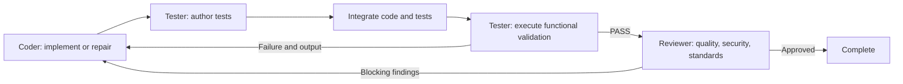

# Coder → Tester → Reviewer

The Coder implements one planned task. The Tester writes independent functional
tests and runs them. A functional failure goes directly to the Coder with the real
command output. Only Tester PASS for the current integrated commit unlocks the
Reviewer. A blocking review goes back to the Coder, and the next implementation
must go through Tester again. Completion requires both gates for the same revision.



Git integration remains before validation, as in the existing application.
Failing code is retained on the target project's `main` for repair; this workflow
does not provide a pre-merge gate or automatic rollback.

## Test ownership and execution

`agents/tester/author-tests.ts` builds the authoring prompt and accepts only a
summary and raw test content. The model cannot choose a write path or a command.
`domain/test-authoring.ts` selects a stable, unshared test directory using the
task's existing test grant or an owned directory. If neither is available,
authoring stops instead of writing into another task's scope.

`workflow/test-authoring.ts` writes one test file per implementation attempt in
the task's worktree, using `AgentTools` with permission for that exact file. The
file is integrated with the implementation before validation. Existing Tester
assertions remain intact across repair attempts: their expected content is saved,
supplied as context, and checked before integration and before execution (allowing
Git's LF/CRLF conversion). Coder
receives the test paths and failure output and is instructed to fix production
behavior. Production source and package configuration are outside the author's
write permissions.

The authoring prompt requires real deterministic assertions against task behavior,
including applicable boundary/error cases. It forbids weakening/skipping tests,
recursive test runners, subprocesses, external network calls and dependency installs.
These content requirements are model instructions; executing generated tests still
uses the existing command permissions and is not an OS security sandbox.

The execution profile uses a declared Jest/Vitest test framework when present,
otherwise Node's built-in test runner. An installed `tsx` loader is used for the
Node profile. Jest/Vitest use their installed local CLIs; no package is downloaded
by the test author. Custom runner/configuration needs may require an injected
author/executor. The default author inspects the root manifest and up to 16 changed
source paths with a 64,000-character total context budget; it does not understand
every monorepo or frontend test environment automatically.

Each saved test file is run explicitly, then existing project validation scripts
run. A project test glob that omits the new file cannot skip its dedicated run.
Nonzero exits and discovered-zero-tests fail validation. A generated Node test run
with zero passes also fails. The model cannot replace actual execution evidence
with a PASS, invent command history, or send a failing implementation to Reviewer.

## Persistence and failure handling

Before writing, the runtime checkpoints the exact test draft. After interruption,
it replays the same draft and accepts an existing file only if its content matches
apart from LF/CRLF conversion.
It does not regenerate an already-saved draft or rerun successful implementation.
Test author model/protocol attempts are persisted and capped at two per Coder
attempt. Author/provider failures stop the task rather than pretending production
code failed a test. A missing/malformed manifest or altered independent assertions
returns actionable setup feedback to Coder within its remaining budget. Explicit
failed-task retry retains earlier tests and feedback.

Functional failures use the existing Coder retry budget. Tester execution failures
retry Tester within its own budget. Reviewer execution failures retry Reviewer.
The default Coder/Tester budgets remain two attempts; there is no unbounded loop.
Review cannot request another Coder attempt when no Tester attempt remains.

Tester PASS is saved with `testerCommit`; Review requires that commit to equal
the current integration. New implementation/integration clears both approvals.
Resume from `tested`, `reviewing` or `reviewed` reuses only matching evidence.
The checkpoint schema rejects active review stages without current successful
test evidence under the new ordering. The `validationOrder` marker migrates older
unfinished runs without trusting a review that ran before tests.

## Configuration and verification

Default CLI workflows enable test authoring and both gates. Existing custom
`executeAgent`/`executeTester` library integrations opt into authoring with
`enableTestAuthoring: true` or `executeTestAuthor`. This keeps injected/offline
executors from unexpectedly making new model calls. Reviewer requires Tester;
configuring `enableCodeReview: true` with `enableTester: false` is rejected.

The new author can be tested without a provider using
`authorTests(request, { ask: scriptedModel })`; the workflow can inject
`executeTestAuthor` independently of `executeTester` and `executeCodeReview`.

```sh
npm run build
npx tsx --test tests/tester/test-authoring.test.ts tests/workflow/workflow-tester-review-loop.test.ts tests/workflow/workflow-code-review.test.ts
npm test
```

Tests cover real authored assertions failing and then passing after Coder repair,
explicit execution outside a project's test glob, Reviewer fixes that break tests,
scope enforcement, independent tests surviving retries, interruption recovery and
revision-bound approval. Scripted responses test the runtime contracts, not the
quality of a live provider's generated tests or review decisions.
